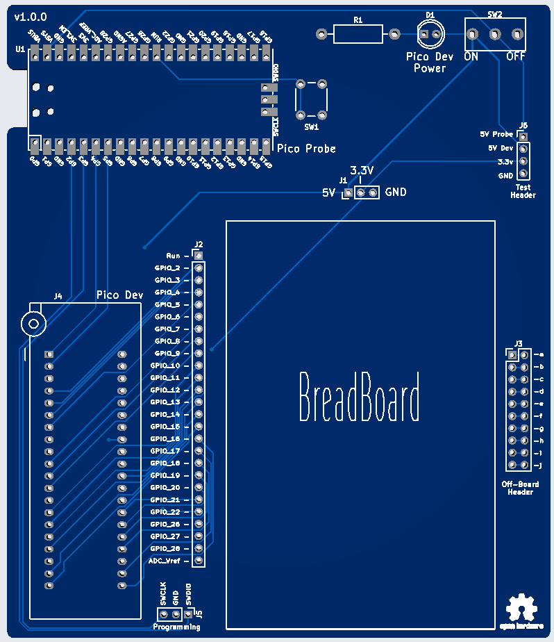
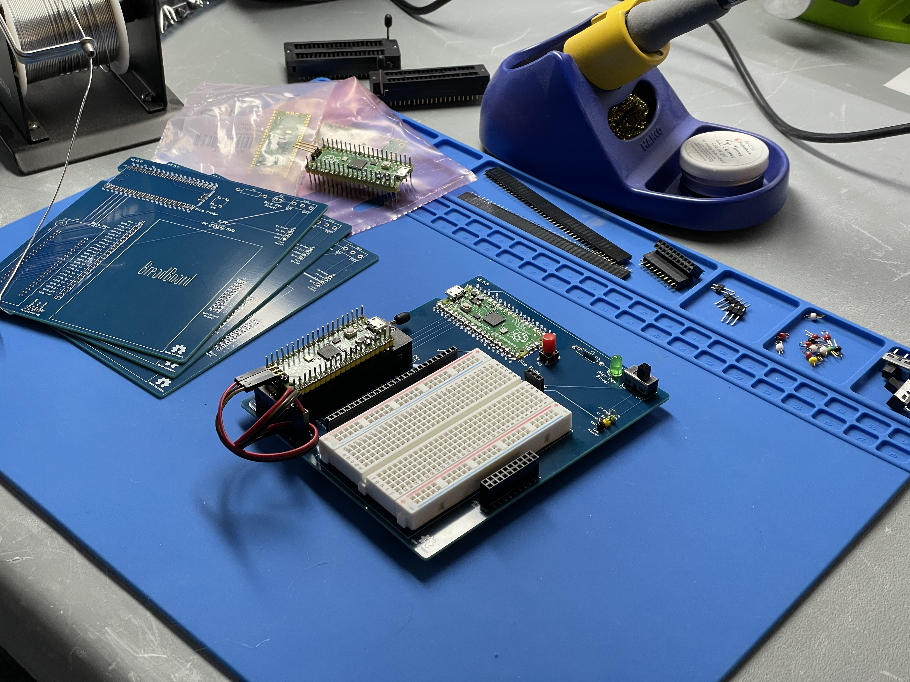
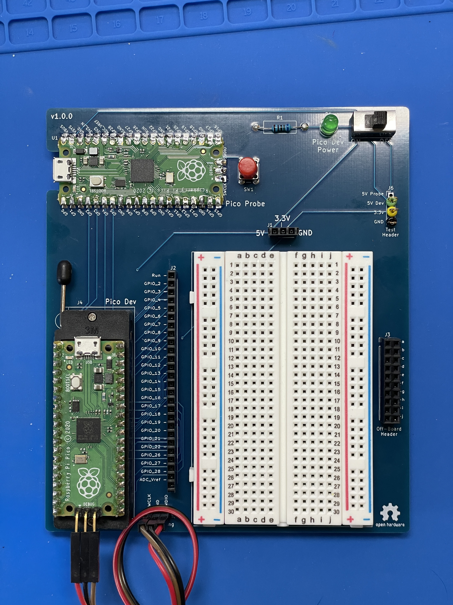
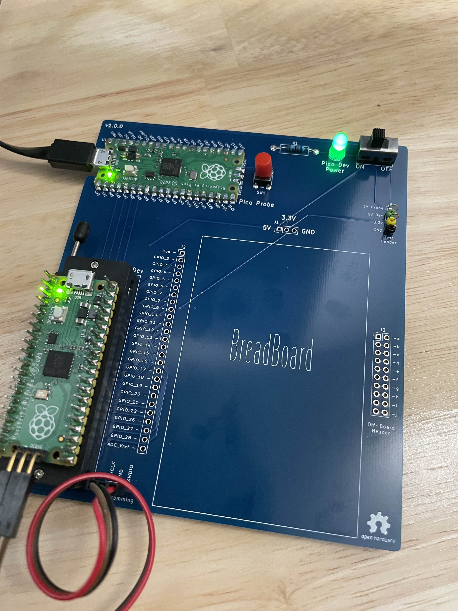

# Pico Devboard - v1.0.0
A very simple and generic development board for a Raspberry Pi Pico that leverages another Pico as a programmer and debugger. The development board is designed to make it simple and cheap to start programming on the Raspberry Pi Pico

**Fabrication Preview**

# Primary Features
* Pico soldered in as a [Pico Probe](https://github.com/raspberrypi/picoprobe)
* [ZIF](https://en.wikipedia.org/wiki/Zero_insertion_force) socket for holding the Pico being developed
* Room for small breadboard
* GPIO, Power, GND, and expansion header located by breadboard
* Probe points for power and ground
* Pico Dev board power switch

# Bill of Materials
*details coming*
* 2x [Raspberry Pi Pico](https://www.pishop.us/product/raspberry-pi-pico/) (U1 and in J4)
* [ZIF socket](https://www.adafruit.com/product/383) (J4)
* [Headers](https://a.co/d/4zF3gvf) (all 2.54mm pitch)
	* 1x - 1x26 GPIO (J2)
	* 2x - 1x3  power and programming (J1 and J5)
	* 1x - 2x10 off-board expansion (J3)
	* 1x - 1x4  test pins (J6)
* [Test Pins](https://a.co/d/6bz0lk5) (J6)
* [Slide switch](https://a.co/d/a2dGuMf) (SW2)
* [Push button](https://a.co/d/cavYAee) (SW1)
* LED (D1)
* Resistor (R1)
* [Breadboard](https://a.co/d/gGRnvQ6)
* [Rubber Standoffs](https://a.co/d/2oCXgiC)

# Ordering
I used [JLCPCB](https://jlcpcb.com) and could buy 10 boards for just under $16.

# Software
See the [Software Readme](software/pico-demo/readme.md)

# Resources
Need to collect links to helpful docs

# Errata
## 1) Serial RX/TX Flipped
**Description**: Serial RX/TX lines flipped from Pico Probe (U1) to Pico Dev (J4).
**Symptom if Uncorrected**: Serial communication will not work.
**Mitigation**:
1. Cut traces, on top of board, coming from U1 pins GP4 and GP5
2. Solder wires, on bottom of board:
	* U1 pin GP4 to J4 pin 2
	* U1 pin GP5 to J4 pin 1

## 2) J5 Silk Screen Misslabelled
**Description**: The labels for SWCLK and SWDIO on J5 are swapped.
**Symptom if Uncorrected**: Programming will fail with an error about the pico not responding.
**Mitigation**: Make correction when wiring

# Future Features
* Move or duplicate J2 to the right side of the breadboard
  * This will make it easier to connect GPIO directly to the off-board expansion header (J3)
* Add 2-pin jumper on 5V trace, between power switch (SW2) and power header (J1)
  * When the jumper is removed the power will be disconnected, allowing for in-line power measurement 

# Images

**Building**

**Built**

**Alive!**

